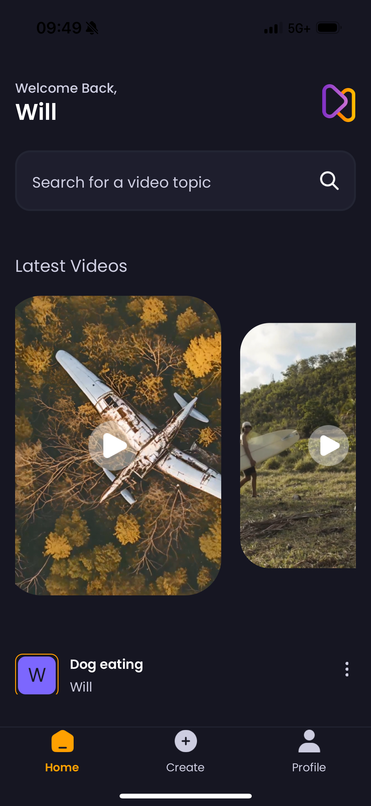

## About this app

Aora is my first project working with React Native, it is a simple photo sharing application that allows users to upload images with captions and AI prompts after they have created an account and logged in.

It contains a home tab with latest posts in a carousel with slight animations, a create post tab to upload new videos and a profile tab to see user videos and logout from the app.

The database is hosted on Appwrite where user information and videos are stored.

I built the app using Expo Go and in this case is for Apple iPhones.

### Functionality & Key Features

I followed a tutorial created by JavaScriptMastery to understand how to build applications with React Native and build my TypeScript skills.

The app utilizes Expo Image Picker in order to access the user device for selecting images and thumbnails.

## Tech Stack

- React Native
- TypeScript
- TailwindCSS (NativeWind)
- Appwrite
- Expo Go

## Screenshots

## Available Scripts

This app runs on Expo Go:

### `npm i`
### `npx expo start -c`

Runs the app in the development mode.\
Open Expo Go app on your iPhone

The page will reload when you make changes.\